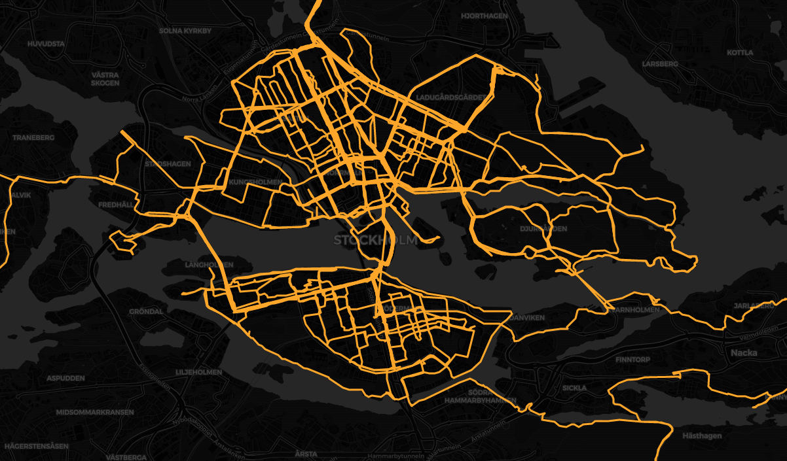

# Strava things
The code in this repository makes use of your Strava data which you can download by
following the instructions below.



## Instructions for downloading Strava account data (as of Aug. 2020)
1. Login to your account at Strava.com
2. Hover over profile picture in the top right corner and go to **Settings**
3. Click **My account** in the left sidebar menu
4. Under **Download or delete your account**, click **Get started**
5. Under **Download request**, click **Request your archive**
6. After a few hours you will receive a zip archive by email. Unzip this somewhere.

## Instructions for generating visualizations

### Prerequisites
- Docker

### Commands
```
./combined-routes.sh path/to/your/unzipped/strava/activities
```
